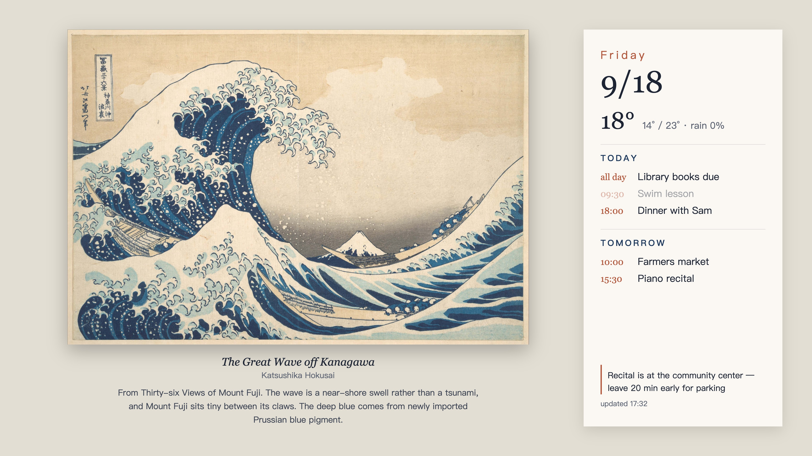

# The Frame family dashboard

Turns a Samsung **The Frame** into a family dashboard that still looks like a framed painting:
a public-domain artwork on the left, today's and tomorrow's calendar on the right, refreshed
every 15 minutes from an always-on Mac.



The TV stays in **art mode** the whole time, so it keeps art mode's brightness, colour
temperature and motion sensor behaviour. Nothing runs on the TV itself — the Mac renders a
3840×2160 JPEG and uploads it as a new piece of "art" every cycle.

## How it works

```
catalog.csv + artwork files ─┐
board.json (calendar, notes) ─┼─► template.html ─► headless Chrome ─► 4K JPEG ─► The Frame
Open-Meteo (weather) ────────┘
```

* `dashboard.py` picks the artwork (one per hour, from a seeded shuffle so neighbouring hours
  aren't the same genre), fills the template, screenshots it with headless Chrome and scales
  the result to 3840×2160.
* `frame.py` talks to the TV over [`samsungtvws`](https://github.com/NickWaterton/samsung-tv-ws-api):
  upload the new image, select it, then delete the one pushed before. Without that delete the
  TV accumulates a copy per refresh.
* A LaunchAgent runs `dashboard.py --push` every 15 minutes between 07:30 and 21:00.

Two deliberate constraints:

* **Never interrupt someone watching TV.** `push()` checks `get_artmode()` first and skips the
  update unless the TV is already in art mode. Pass `--force` to override.
* **Never lose an existing gallery.** The script only ever deletes the content id it uploaded
  itself, recorded in `~/.config/frame-dashboard/dashboard-state.json`.

## Setup

Requires macOS, Python 3.10+, Google Chrome, and a Frame TV on the same LAN (tested on a 2022
`QN55LS03BAFXZA`; the art API covers roughly 2021–2024 models).

```bash
git clone https://github.com/xingfenghe/the-frame-family-dashboard
cd the-frame-family-dashboard
python3 -m venv .venv && .venv/bin/pip install -r requirements.txt
cp config.example.json config.json    # set tv_host and art_dir
cp board.example.json board.json
```

Pair with the TV once — it shows an "Allow" prompt you accept with the remote:

```bash
.venv/bin/python -W ignore frame.py status
```

Then render and push:

```bash
.venv/bin/python -W ignore dashboard.py --push
python3 install_launchagent.py        # every 15 min, 07:30–21:00
```

### Artwork directory

`config.json → art_dir` points at a folder holding:

```
catalog.csv        id,title,artist,...   (one row per artwork)
ready/<id>.jpg     16:9 crop, used as a fallback
raw/<id>.source    optional uncropped original, preferred when its aspect ratio fits
```

Museum open-access collections (the Met, National Gallery of Art, Cleveland Museum of Art,
Rijksmuseum) and NASA's image library are good sources. `art-notes.json` maps an id to a
sentence or two of background shown under the painting; see `art-notes.example.json`.

### Calendar

`board.json` is plain JSON, so anything can write it — an iCal fetcher, a shortcut, a cron job,
or an assistant with calendar access. This repo deliberately ships no calendar integration:
mine is a scheduled Claude Code task that reads Google Calendar three times a day, writes
`events`/`hide`/`notes`, and runs `dashboard.py --push`. The renderer only reads the file.

Keep `board.json` to today plus the next two days. If it only holds today and tomorrow, the
"tomorrow" column goes empty the moment the clock passes midnight.

## Four macOS gotchas for background jobs

Most of the work in this project was not the TV API. It was getting a LaunchAgent to do what
the same command does happily in a terminal.

1. **Files in a cloud folder.** A LaunchAgent has no access to `~/Library/CloudStorage/...`
   until you grant it: the job hangs inside `open()` with no error while macOS waits on a
   consent dialog. Either grant the Python binary access (Privacy & Security → Files and
   Folders / Full Disk Access) or keep the code and assets on local disk.
2. **Online-only cloud files.** A dataless placeholder can't be materialised by a background
   process; `Image.open()` fails with `OSError: [Errno 11] Resource deadlock avoided`. Mark the
   folder "available offline", and keep a fallback path in code.
3. **Local Network privacy.** macOS 15+ blocks LAN access for background processes until
   approved, and the failure looks like a network fault: `OSError: [Errno 65] No route to host`,
   while the exact same script works from a terminal. Enable your Python binary under
   Privacy & Security → Local Network.
4. **`StartInterval` runs all night.** `StartCalendarInterval` with an explicit list of times is
   how you get a daytime-only job; `install_launchagent.py` generates it.

## Layout notes

The card is a fixed-size box on a 1920×1080 page, so overflow is a real failure mode. What
worked: put the artwork caption *under the painting* where there is room, clip the card, cap
each day at a few rows with a "N more" line, pin reminders to the bottom, and clamp event
titles to one line. A long blurb plus a packed calendar then degrades gracefully instead of
spilling off the card.

## Limitations

* Art mode occasionally exits on its own; the next cycle simply skips rather than fighting it.
* Powering the TV on from standby needs Wake-on-LAN, which this repo doesn't do.
* One artwork per hour means the JPEG is re-uploaded every 15 minutes regardless — the TV
  handles this fine, but it is not a live display.

## License

MIT
